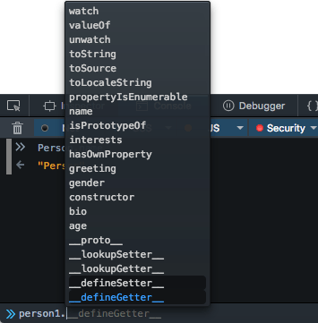

## 객체 기본

객체는 관련된 데이터와 함수(일반적으로 여러 데이터와 함수로 이루어지는데, 객체 안에 있을 떄는 보통 프로퍼티와 메소드라고 부른다.)

```js
const person = {
    name: ["Bob", "Smith"],
    age: 32,
    gender: "male",
    interests: ["music", "skiing"],
    bio: function () {
        alert(
            this.name[0] +
                " " +
                this.name[1] +
                " is " +
                this.age +
                " years old. He likes " +
                this.interests[0] +
                " and " +
                this.interests[1] +
                "."
        );
    },
    greeting: function () {
        alert("Hi! I'm " + this.name[0] + ".");
    },
};
```

객체를 구성하는 멤버의 값은 어떤 것이라도 될 수 있다. 객체의 값 중 문자열, 숫자, 배열은 객체의 프로퍼티(속성)이라 불린다.
함수는 함수를 통해 데이터를 가지고 뭔가 일을 할 수 있게 된다. 이걸 우리는 메소드라고 부른다.

이런 객체는 객체 리터럴(object literal)이라 부른다. 객체를 생성할 때 컨텐츠를 그대로 대입합니다. 객체 리터럴은 클래스로부터 생성하는 방식과는 다릅니다

### "this"는 무엇인가?

```js
greeting: function() {
  alert('Hi! I\'m ' + this.name.first + '.');
}
```

this 키워드는 지금 동작하고 있는 코드를 가지고 있는 객체를 가리킨다.
예제의 this는 person 객체와 동일하다.

this는 객체 멤버의 컨텐스트가 바뀌는 경우에도 언제나 정확한 값을 사용하게 해줍니다.

<br>
<br>

## 객체지향 프로그래밍 - 기초

OOP의 기본 컨셉은 프로그램 내에서 표현하고자 하는 실 세계(real world)의 일들을 객체를 사용해서 모델링 하고, 객체를 사용하지 않으면 불가능 혹은 무지 어려웠을 일들을 쉽게 처리하는 방법을 제공한다.

객체는 당신이 모델링하고자 하고자 하는 일이나 기능 혹은 필요한 행동들을 표현하는 프로그램 코드와 그와 연관된 데이터로 구성됩니다. 객체는 데이터(그리고, 함수 역시)를 감싸서 ,(공식적인 표현으로는 encapsulate) 객체 패키지(해당 객체를 참조하기 위한 이름. namespace 라고도 불리죠)안에 보관합니다. 이는 계층 구조를 만드는데 용이하고 사용하기에도 쉽게 하기 위해서죠; 또한, 객체는 네트워크를 통해 쉽게 전송될 수 있도록 데이터를 저장하는 용도로도 많이 사용됩니다.

위의 Person 객체로 돌아가봅시다. 거기서 "사람"에 대한 기초적인 데이터와 기능을 정의했었죠. "사람"을 구별할 수 있는 특징은 많습니다 (그들의 주소, 키,신발사이즈, DNA 프로필, 여권번호, 중요한 개인적 자실 등 ...) ,하지만 이 예제에서는 오직 이름, 나이, 성별 그리고 취미만을 다룰겁니다. 여기에 더불어 이 데이터를 기반으로 각 개인에 대한 간단한 소개말과 인사말을 표시할 수 있도록 할 겁니다 . 이런 과정을 **추상화** — 프로그래머의 의도에 맞추어 가장 중요한 것들만을 뽑아서 복잡한 것들을 보다 단순한 모델로 변환하는 작업 - 라고 합니다.

클래스로부터 객체의 인스턴스가 생성될 때는 클래스의 생성자 함수 가 호출됩니다.클래스에서 객체 인스턴스가 생성되는 일련의 과정을 **인스턴스화(instantiation)**라고 합니다 — 객체의 인스턴스는 클래스를 통해 만들어집니다

<br>
<br>

### 특별한 클래스

이번에는 일반적인 사람이 아니라 — 일반적인 사람보다 세분화된 선생님과 학생들이 필요합니다. OOP 에서는,특정 클래스를 기반으로 새로운 클래스를 만들 수 있습니다 — **child 클래스** 는 **부모 클래스를 상속** 받아서 만들어집니다. child 클래스는 상속을 통해 부모 클래스에 정의된 데이터와 함수를 고스란히 사용할 수 있습니다. 클래스마다 기능이 달라지는 부분이 있다면, 직접 해당 클래스에 원하는 기능을 정의할 수 있습니다.

<br>
이것은 매우 유용합니다. 이름,성별,나이 등과 같이 선생님과 학생이 공유하는 많은 공통적인 특징들을 한번만 정의해도 되기 때문이죠. 또한 서로 다른 클래스에 같은 기능을 따로 정의할 수도 있습니다. 정의된 각각의 기능은 서로 다른 namespace에 존재하기 때문입니다. 예를 들어, 학생의 인사는 "안녕, 난 [이름]이야." 와 같은 형식이 될 것입니다. (ex) 안녕, 난 샘이야.) 반면 선생님은 "안녕하세요, 제 이름은 [성] [이름]이고 [과목명]을 담당하고 있습니다." 와 같이 좀 더 격식있는 형식을 사용할 것입니다.

> 여러 객체 타입에 같은 기능을 정의할 수 있는 능력을 **다형성(polymorphism)**이라고 한다.

<br>
<br>

### 생성자와 객체 인스턴스

자바스크립트는 객체와 그 기능을 정의하기 위해 생성자 함수라고 불리는 특별한 함수를 사용합니다. 이는 보통 우리가 얼마나 많은 객체들을 생성해야 할지 모르기 때문에 유용합니다. 생성자는 효율적으로 필요한 만큼 객체를 생성하고, 데이터와 함수들을 설정하는 방법을 제공합니다.

생성자로부터 새로운 객체 인스턴스가 생성되면, 객체의 핵심 기능 (프로토타입에 의해 정의됩니다. Object prototypes 글에서 자세히 다룰 것입니다.)이 프로토타입 체인에 의해 연결됩니다.

> 관습적으로, 생성자 함수명은 대문자로 시작하게 한다. 이 규칙은 생성자 함수가 코드 안에서 잘 구별되도록 해준다.

<br>
<br>

## 프로토타입 기반 언어

JavaScript는 흔히 프로토타입 기반 언어(prototype-based language)라 불린다.
모든 객체들이 메소드와 속성들을 상속 받기 위한 템플릿으로써 프로토타입 객체(prototype object)를 가진다는 의미이다.
프로토타입 객체도 또 다시 상위 프로토타입 객체로부터 메소드와 속성을 상속받을 수도 있고 그 상위 프로토타입 객체도 마찬가지이다.

이를 **프로토타입 체인(prototype chain)**이라 부르고 다른 객체에 정의된 메소드와 속성을 한 객체에서 사용할 수 있도록 하는 근간이다.

정확히 말하자면 상속되는 속성과 메소드들은 각 객체가 아니라 객체의 생성자의 prototype이라는 속성에 정의되어 있다.

JavaScript에서는 객체 인스턴스와 프로토타입 간에 연결(많은 브라우저들이 생성자의 prototype 속성에서 파생된 **proto** 속성으로 객체 인스턴스에 구현하고 있습니다.)이 구성되며 이 연결을 따라 프로토타입 체인을 타고 올라가며 속성과 메소드를 탐색합니다.

-   예시

```js
function Person(first, last, age, gender, interests) {
    // 속성과 메소드 정의
    this.first = first;
    this.last = last;
    //...
}
```

```js
var person1 = new Person("Bob", "Smith", 32, "male", ["music", "skiing"]);
```

위 코드 작성 후 웹 브라우저 콘솔에서 'person1'을 치게 되면 아래처럼 보여질 것이다.



위에서 person1의 프로토타입 객체인 Person()에 정의된 멤버들 — name, age, gender, interests, bio, greeting을 볼 수 있습니다. 또한 — watch, valueOf처럼 Person()의 프로토타입 객체인 Object에 정의된 다른 멤버들도 보실 수 있습니다. 이는 프로토타입 체인이 동작한다는 증거입니다.

그럼 실제로는 Object에 정의되어 있는 메소드를 person1에서 호출하면 어떻게 될까요?
아래 처럼 말이죠:

```js
person1.valueOf();
```

<br>
이 메소드는 호출된 객체의 값을 단순 반환합니다. — 직접 실행해 보세요! 이때 일어나는 일은 아래와 같습니다:

-   브라우저는 우선 person1 객체가 valueOf() 메소드를 가지고 있는지 체크합니다.
-   없으므로 person1의 프로토타입 객체(Person() 생성자의 프로토타입)에 valueOf() 메소드가 있는지 체크합니다.
-   여전히 없으므로 Person() 생성자의 프로토타입 객체의 프로토타입 객체(Object() 생성자의 프로토타입)가 valueOf() 메소드를 가지고 있는지 체크합니다. 여기에 있으니 호출하며 끝납니다!

> 프로토타입 체인에서 한 객체의 메소드와 속성들이 다른 객체로 복사되는 것이 아님을 재차 언급합니다. — 위에서 보시다 시피 체인을 타고 올라가며 접근할 뿐입니다.
>
> > 많은 수의 모던 브라우저들이 **proto** (앞뒤로 언더바 2개씩) 속성을 통해 특정 객체의 프로토타입 객체에 접근할 수 있도록 구현하였습니다. 예를 들자면 person1.**proto** 또는 person1.**proto**.**proto** 코드로 체인이 어떻게 구성되어 있는지 확인해 보세요!
> > ECMAScript 2015부터는 Object.getPrototypeOf(obj) 함수를 통해 객체의 프로토타입 객체에 바로 접근할 수 있게 되었습니다

<br/>

### 프로토타입 속성 : 상속 받은 멤버들이 정의된 곳

그럼 상속 받은 속성과 메소드들은 어디에 정의되어 있을까요? Object 레퍼런스 페이지에 가시면 좌측에 수 많은 속성과 메소드들이 나열되어 있는 것을 볼 수 있습니다. — 위 스크린샷에서 person1가 상속받은 멤버들보다 훨씬 많죠. 일부는 상속 되었지만 나머지는 아닙니다. — 왜일까요?

정답은 상속 받는 멤버들은 prototype 속성(sub-namespace라고도 하죠)에 정의되어 있기 때문입니다. — Object.로 시작하는게 아니라, Object.prototype.로 시작하는 것들이죠. prototype 속성도 하나의 객체이며 프로토타입 체인을 통해 상속하고자 하는 속성과 메소드를 담아두는 버킷으로 주로 사용되는 객체입니다.

> 함수 역시 객체의 하나입니다

> Important: prototype 속성은 Javascript에서 가장 헷갈리는 명칭중 하나입니다. — 보통 this가 현재 객체의 프로토타입 객체를 가리킬 것이라 오해하지만 그렇지 않죠. (프로토타입 객체는 **proto** 속성으로 접근 가능한 내장 객체인 것 기억 하시나요?). 대신에 prototype 속성은 상속 시키려는 멤버들이 정의된 객체를 가리킵니다.
> <br> > <br>
